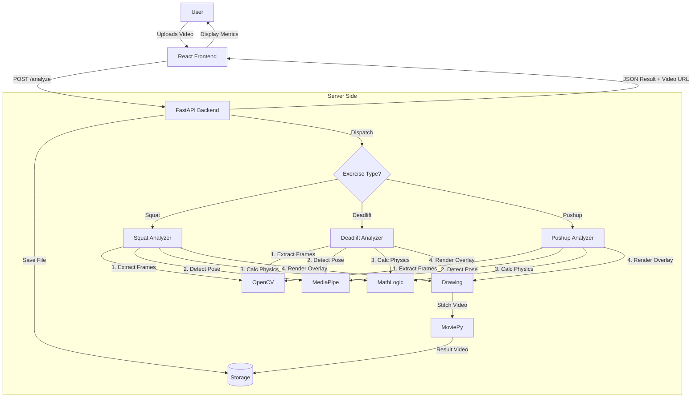

# GymBro AI - System Architecture Documentation

## 1. System Overview
**GymBro AI** is a full-stack web application designed to analyze exercise form using computer vision. It follows a client-server architecture:

*   **Frontend**: A modern, responsive React application (Vite) that handles user interaction, file uploads, and results visualization.
*   **Backend**: A high-performance Python server (FastAPI) that processes video files, runs AI pose estimation, and generates detailed feedback.

---

## 2. Frontend Architecture (Client)
**Location:** `/client`
**Tech Stack:** React, Vite, Framer Motion, CSS Modules.

### Key Workflows
1.  **Landing & Onboarding**:
    *   **Components**: `IntroAnimation.jsx`, `LandingPage.jsx`.
    *   **Logic**: Handles the initial "Click to Start" (resolving browser autoplay policies) and plays the background music.
2.  **Exercise Selection**:
    *   **Page**: `ExerciseSelection.jsx`.
    *   **Logic**: Users select their target exercise (Squat, Deadlift, Pushup). This selection is stored in React state/Local Storage to be sent to the backend later.
3.  **Video Upload & Analysis**:
    *   **Page**: `VideoAnalysis.jsx`.
    *   **Logic**:
        *   Accepts video file via Drag & Drop.
        *   Sends a `POST` request to `http://localhost:8000/analyze`.
        *   Displays a loading screen (`LoadingScreen.jsx`) while polling/waiting.
        *   Renders the JSON response (Rep count, Feedback cards) and the processed video URL.

### API Integration
*   The frontend uses standard `fetch` or `axios` to communicate with the backend.
*   It handles **CORS** (Cross-Origin Resource Sharing) since the frontend runs on port `5173` and backend on `8000`.

---

## 3. Backend Architecture (Server)
**Location:** `/server`
**Tech Stack:** Python 3.12, FastAPI, Uvicorn, MediaPipe, OpenCV, MoviePy.

### Core Components
1.  **API Gateway (`main.py`)**:
    *   **Endpoint**: `POST /analyze`
    *   **Function**: Receives the video file + exercise type.
    *   **Router**: Logic switches based on `exercise_type` (e.g., if "squat" -> call `analyze_squat_video`).
    *   **File Handling**: Saves raw uploads to `/server/uploads` and formatted results to `/server/outputs`.

2.  **Computer Vision Pipeline (`/server/core/`)**:
    This is the "Brain" of the application. Each exercise has a dedicated analyzer file.

    *   **`squat_analyzer.py`**:
        *   **Metrics**: Calculates Knee Angle (Target: 90°) and Torso Angle.
        *   **Standard**: NSCA (National Strength and Conditioning Association).
        *   **Feedback**: "Insufficient Depth", "Good Parallel", "Heels rising".

    *   **`deadlift_analyzer.py`**:
        *   **Logic**: Uses a **Finite State Machine** (Setup -> Pull -> Lockout -> Lower).
        *   **Metrics**: Back Angle (Target: 40-50°), Knee Extension (Lockout).
        *   **Feedback**: "Back too rounded", "Incomplete Lockout", "Hips rising too fast".

    *   **`pushup_analyzer.py`**:
        *   **Metrics**: Elbow Angle (90°), Hip Sag (Pixel distance from shoulder-ankle line).
        *   **Feedback**: "Hip Sag detected", "Chest not low enough".

---

## 4. The Analysis Pipeline (Step-by-Step)
When a user uploads a video, the following chain reaction occurs:

### Step 1: Ingestion
*   The video is saved individually to disk to prevent memory overflows with large files.

### Step 2: Frame Processing Loop
The analyzer reads the video **frame by frame** using `OpenCV`:
1.  **Pose Estimation**: `MediaPipe` scans the frame and finds 33 "Landmarks" (Keypoints: Shoulder, Elbow, Hip, Knee, Ankle, etc.).
2.  **Geometry Calculation**:
    *   The code converts these normalized landmarks (0.0 to 1.0) into pixel coordinates `(x, y)`.
    *   **Trigonometry**: Calculates angles between vector triplets (e.g., Hip-Knee-Ankle for Squat depth).
3.  **Rule Evaluation**:
    *   Compares current angles against the **NSCA Constants** defined at the top of the file.
    *   *Example*: `If Knee Angle < 90 AND State == Descending -> Flag "Good Depth"`.
4.  **Drawing**:
    *   Draws the skeleton overlay and angle numbers directly onto the frame pixel data.
    *   Adds the "Info Panel" at the bottom (Black box with text).

### Step 3: Video Assembly
*   The processed frames are collected into a list.
*   **MoviePy** (`moviepy<2.0`) stitches these frames back into an `.mp4` video file.
*   *Optimization*: We use the `ultrafast` codec preset to minimize user wait time.

### Step 4: Response
*   The backend returns a JSON object containing:
    *   `reps_count`: Total valid reps counted.
    *   `feedback`: List of text strings (e.g., ["Good Depth", "Keep back straight"]).
    *   `download_url`: Link to the processed video.

---

## 5. Data Flow Diagram

## 6. Key Features
*   **Robust Metrics**: Instead of guessing, we use specific angle thresholds (e.g., 90 degrees) derived from professional coaching standards.
*   **State Machines**: To count reps accurately, we don't just look at angles; we track "phases" (Eccentric -> Concentric) so we don't accidentally count half-reps or wobbles.
*   **Error Handling**: If a user walks out of frame, the system pauses analysis gracefully instead of crashing.
